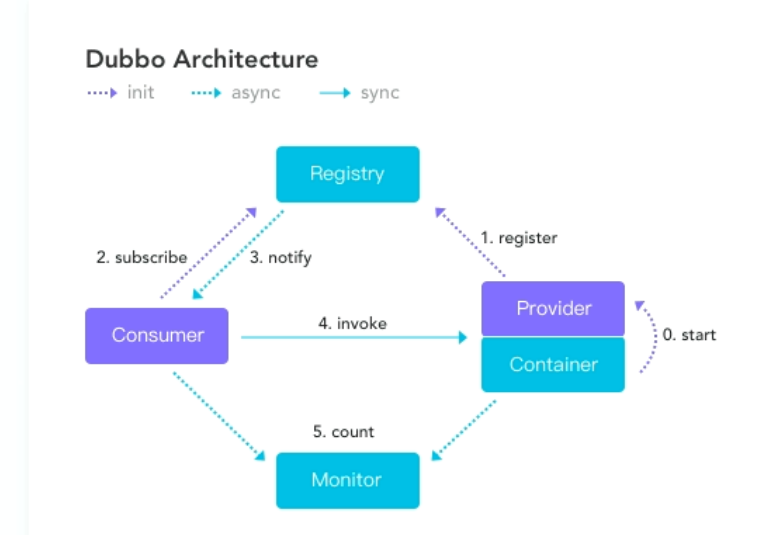
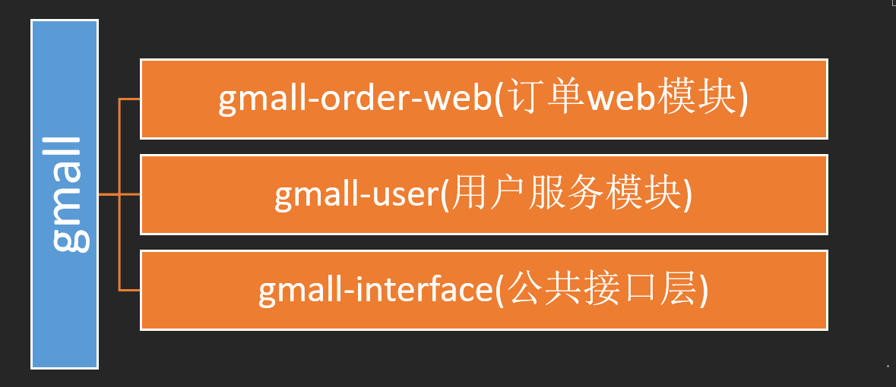
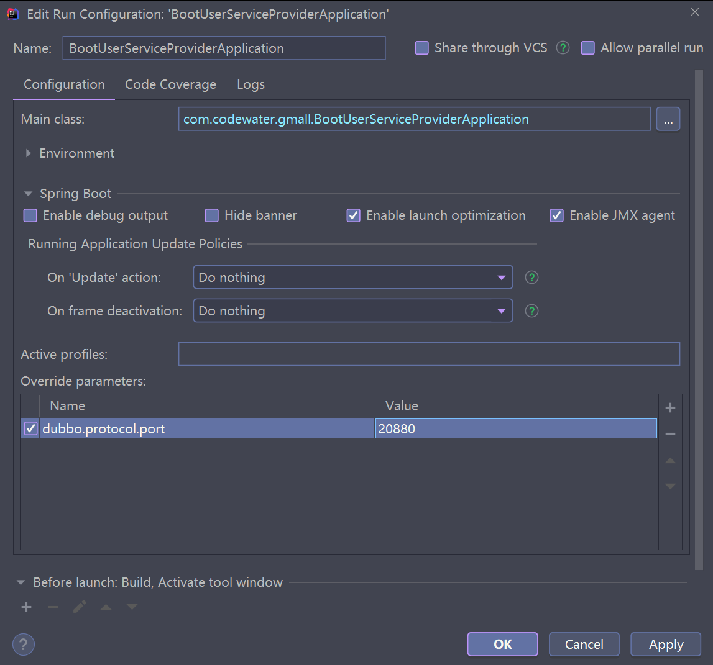
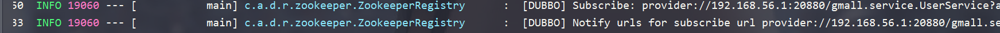

> 模拟分布式，远程调用rpc


# 第一个商城实践

结构图：






1. dubbo后台管理地址：localhost：7001

2. 把消费者和生产者注册到注册中心需要先开启zookeeper

3. dubbo-admin管理页面：localhost：8080

   （需要看配置里面的zookeeper地址是否正确）

4. 


## gmall-interface

放公共的接口和service（业务）


## order-service-consumer

订单业务的消费具体实现。（**消费者类型**）

相当于一个远程，

1. pom中需要引入gmall的依赖（根据创建的具体maven工程引入）

   ```java
   <dependency>
               <groupId>com.codewater</groupId>
               <artifactId>gmall-interface</artifactId>
               <version>1.0-SNAPSHOT</version>
           </dependency>
   ```

   


## user-service-provider

用户下订单的具体实现（**提供者类型**）

相当于一个远程

1. pom中需要引入gmall的依赖（根据创建的具体maven工程引入）

   ```java
   <dependency>
               <groupId>com.codewater</groupId>
               <artifactId>gmall-interface</artifactId>
               <version>1.0-SNAPSHOT</version>
           </dependency>
   ```


# 使用springBoot实现


## boot-user-service-provider

生产方，复制上面maven工程中的对应实体类

1. 加入对应的实体类依赖

```java
<dependency>
            <groupId>com.codewater</groupId>
            <artifactId>gmall-interface</artifactId>
            <version>1.0-SNAPSHOT</version>
        </dependency>
```

2. 原来的xml配置到properties中去配置

3. `@Service`暴露服务（dubbo的）

4. 测试哪个配置生效是，vm的配置在这里

   

   可以看到是vm的配置优先生效

   

5. 


## boot-order-service-consumer

消费方，复制上面maven工程中的对应实体类。这个是一个web工程

1. 加入对应的实体类依赖

2. 改properties的配置

3. 写controller的方法

   `@Reference`：消费服务，远程引用

4. 启动，浏览器：localhost:8081/initOrder?uid=1会出现对应的用户地址信息

   