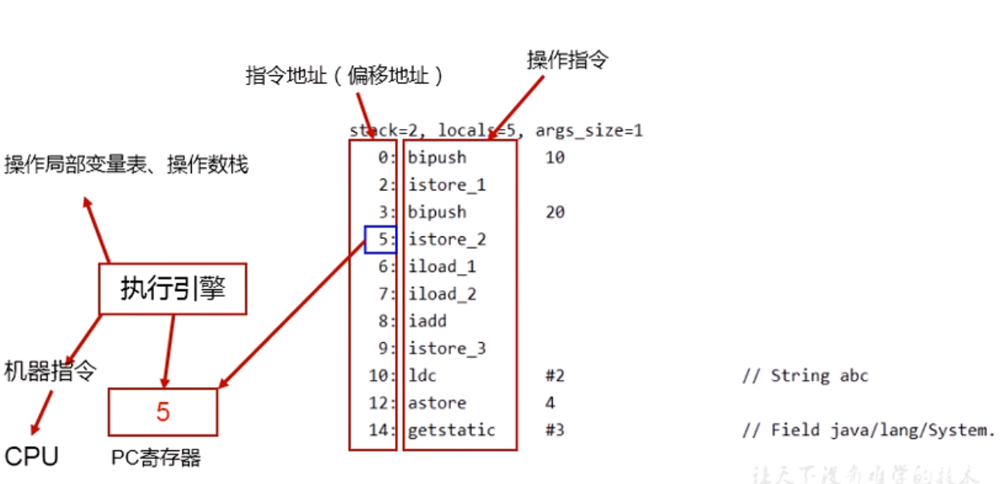

[TOC]


# JVM

参考来自尚硅谷，侵权请联系


# 整体结构


## 执行流程


## 生命周期


### 启动


### 执行


### 退出


## JIT

即时编译器：会找到程序中的热点代码（执行次数比较多的），加到缓存中，下次直接从缓存中取。


## 命令解释

```
jps：打印当前程序中执行的进程

javap -v 类名.class：反编译某个类

iconst_2: 定义常量2
istore_1: 保存在操作数栈栈中，1是一个索引位置
iload_1: 加载保存的数，索引1的位置
iadd： 求和操作


```


# chapter01

1. 反编译命令：`javap -v 类名.class` 

   


2. 栈和寄存器的指令集架构

   


3. 


## StackStruTest


# 类加载子系统

`Class Loader Subsystem`

简略：


详细：


## 内容


### 类加载子系统作用


### 类加载器角色


### 类的加载过程


1. 加载

   

2. 链接

   

### 类加载器分类


1. 虚拟机自带的加载器

   

   

   

   

2. 用户自定义类加载器

   

   > 自定义类加载器的实现步骤：
   >
   > 
   >
   > ```java
   > public class CustomClassLoader extends ClassLoader {
   >     
   >     @Override
   >     protected Class<?> findClass(String name) throws ClassNotFoundException {
   > 
   >         try {
   >             byte[] result = getClassFromCustomPath(name);
   >             if(result == null){
   >                 throw new FileNotFoundException();
   >             }else{
   >                 return defineClass(name,result,0,result.length);
   >             }
   >         } catch (FileNotFoundException e) {
   >             e.printStackTrace();
   >         }
   > 
   >         throw new ClassNotFoundException(name);
   >     }
   > 
   >     private byte[] getClassFromCustomPath(String name){
   >         //从自定义路径中加载指定类:细节略
   >         //如果指定路径的字节码文件进行了加密，则需要在此方法中进行解密操作。
   >         return null;
   >     }
   > 
   >     public static void main(String[] args) {
   >         CustomClassLoader customClassLoader = new CustomClassLoader();
   >         try {
   >             Class<?> clazz = Class.forName("One",true,customClassLoader);
   >             Object obj = clazz.newInstance();
   >             System.out.println(obj.getClass().getClassLoader());
   >         } catch (Exception e) {
   >             e.printStackTrace();
   >         }
   >     }
   > }
   > 
   > ```


### 关于`classLoader`


### 获取classloader的途径


## 双亲委派机制


### 工作原理


> 优先找上层去处理，上层能够处理就处理，不能处理就交由子类去处理。


### 优缺点


#### 优点


###  沙箱安全机制


## 其他


## 对类加载器的引用


​                                                                                                                                                                                                                                                                                                                                                                                                                                                                                                                                                                                                                                                                                                                                                                                                                                                                                                                    

# 运行时数据区


经典的布局：


具体一点;


> 1. `95%`是对`堆区`进行优化的；<u>5%是优化方法区</u>。
>
> 2. 其余的虚拟机栈和本地方法栈没有什么要优化的。
> 3. 一个`RunTime`类对应一个虚拟机，也相当于一个运行时数据区


## 线程


> 如果run方法不是正常结束的话，java线程会结束运行，但是本地线程要看情况：
>
> 1. 本地线程需要决定jvm是不是要终止
> 2. jvm要不要终止，取决于当前线程是不是最后一个非守护线程。如果当前程序中只剩下都是守护线程的话，那么jvm就可以退出；如果是非守护线程，jvm就要被停掉
>    1. 线程分为：守护线程、普通线程
>    2. User Thread(普通线程)：不随主线程的结束而结束，直到自己运行完
>    3. Daemon Thread(守护线程) ：当前JVM存在普通线程时，守护线程就还可以工作(除非自己结束)


### JVM系统线程


## 程序计数器（PC寄存器）


### PC Register介绍

最详细的是[官网](https://docs.oracle.com/javase/specs/jvms/se8/html/), 8和之后的版本内存方面变化不大，主要是在垃圾回收方面区别。


> 1. PC和栈没有垃圾回收区域
> 2. PC没有溢出；但是栈有可能会溢出OOM超出内存（栈满）
> 3. 方法区和堆区有可能溢出，也有垃圾回收GC


### 举例说明





### 两个常见问题

1. 

2. 意思是问：PC寄存器为什么每个线程都有一份？

   

   > 简单来说：如果PC共享
   >
   > 当前线程执行到第5行时，CPU切换执行线程2，那么PC就会被改变到第7行，那再切换回来执行线程1的时候就会出错，应该从第5行开始执行，但现在被线程2执行后改变了不是5.


> 并发：同一时间段内
>
> 并行：同时执行（多核CPU的时候）


## 虚拟机栈

官网


### 概述


### 基本内容


> 但是会有OOM内存溢出的异常


### 栈的存储单位


#### 运行原理


> 抛出异常指的是：
>
> 没有处理的异常，即没有try、catch的的；如果try了还是属于正常的返回return。


#### `栈帧`的内部结构


### 局部变量表


### 操作数栈


### 代码追踪


### 栈顶缓存技术


### 动态链接


### 方法的调用：解析与分派


### 方法返回地址


### 一些附加信息


### 栈的相关面试题


# 工具

1. `Binary viewer`：查看二进制文件的

2. `Bytecode viewer`：查看字节码文件的（是个jar包，双击直接打开）

   > 是一款基于图形界面的 Java 反编译器，Java 字节码编辑器，APK 编辑器，APK 反编译器，Dex 编辑器，DEX 反编译器，其集成了 6 个 Java 反编译库（包含 Procyon、CFR 和 Fernflower），Andorid 反编译类库和字节码类库。不仅如此，它还是一款 Hex 查看器，代码搜索器和代码调试器。除此之外，它还具备 Smali 和 Baksmali 等汇编器的相关功能。
   > 它完全用 Java 编写，并且是开源的。 它目前由 Konloch 维护和开发。
   > 还有一个插件系统可以让您与加载的类文件进行交互，例如您可以编写一个字符串反混淆器、恶意代码搜索器或其他您能想到的东西。
   > 您可以使用预先编写的插件之一，也可以编写自己的插件。 它支持 Groovy、Python 和 Ruby 脚本。
   > 一旦插件被激活，它会将文件系统中加载的每个类的 ClassNode ArrayList 发送到执行函数，这允许用户使用 ASM 完全处理它。

3. `Jclasslib bytecode viewer`:字节码分析工具（idea也有类似的插件；在菜单栏中的`view`）

   

4. 

