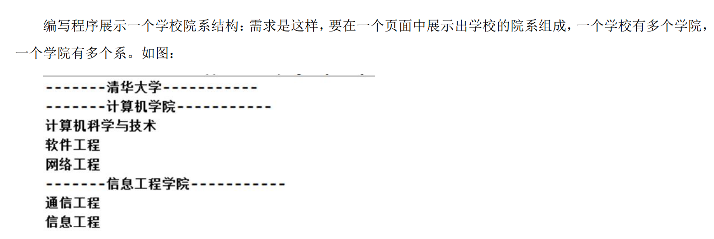
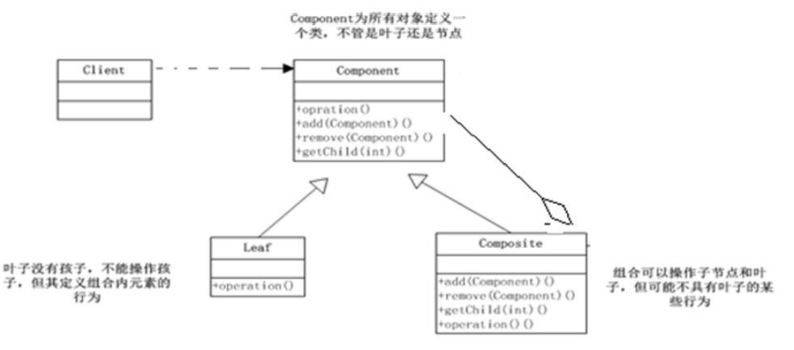

[TOC]


# 设计模式笔记


# 七大原则

设计模式常用的七大原则有：

### 1.单一职责原则

#### 概念

对类来说的，即一个类应该只负责一项职责。如类 A 负责两个不同职责：职责 1，职责 2。当职责 1 需求变更 而改变 A 时，可能造成职责 2 执行错误，所以需要将类 A 的粒度分解为 A1，A2


#### 单一职责原则注意事项和细节 

1. 降低类的复杂度，一个类只负责一项职责。

2. 提高类的可读性，可维护性 

3. 降低变更引起的风险 

4. 通**常情况下，我们应当遵守单一职责原则，**只有逻辑足够简单，才可以在代码级违反单一职责原则；只有类中 方法数**量足够少**，可以**在方法级别保持单一职责原则**


### 2.接口隔离原则

#### 概念

客户端不应该依赖它不需要的接口，即一个类对另一个类的依赖应该建立在<font color="red">**最小**</font>的接口


### 3.依赖倒转原则


#### 概念

依赖倒转原则(Dependence Inversion Principle)是<font color="yellow">指</font>： 

1. 高层模块不应该依赖低层模块，二者都应该依赖其抽象 
2. 抽象不应该依赖细节，细节应该依赖抽象 
3.  依赖倒转(倒置)的中心思想是面向接口编程 
4.  依赖倒转原则是基于这样的设计理念：相对于细节的多变性，抽象的东西要稳定的多。以抽象为基础搭建的架 构比以细节为基础的架构要稳定的多。在 java 中，抽象指的是接口或抽象类，细节就是具体的实现类 
5.  使用接口或抽象类的目的是制定好规范，而不涉及任何具体的操作，把展现细节的任务交给他们的实现类去完 成


#### 依赖关系的三种传递

1. 接口传递
2. 构造方法传递
3. setter方式传递


#### 注意事项和细节

1. 低层模块尽量都要有抽象类或接口，或者两者都有，程序稳定性更好. 
2.  变量的声明类型尽量是抽象类或接口, 这样我们的变量引用和实际对象间，就存在一个缓冲层，利于程序扩展 和优化 
3. 继承时遵循里氏替换原则


### 4.里氏替换原则


#### 面向对象OO中继承性的思考

1. 继承包含这样一层含义：父类中凡是已经实现好的方法，实际上是在设定规范和契约，虽然它不强制要求所有 的子类必须遵循这些契约，但是如果子类对这些已经实现的方法任意修改，就会对整个继承体系造成破坏。 
2.  继承在给程序设计带来便利的同时，也带来了弊端。比如使用继承会给程序带来侵入性，程序的可移植性降低， 增加对象间的耦合性，如果一个类被其他的类所继承，则当这个类需要修改时，必须考虑到所有的子类，并且 父类修改后，所有涉及到子类的功能都有可能产生故障 
3. 问题提出：在编程中，如何**正确的使用继承**? => 里氏替换原


#### 基本介绍

1. 如果对每个类型为 T1 的对象 o1，都有类型为 T2 的对象 o2，使得以 T1 定义的所有程序 P 在所有的对象 o1 都 代换成 o2 时，程序 P 的行为没有发生变化，那么类型 T2 是类型 T1 的子类型。换句话说，<font color="yellow">所有引用基类的地 方必须能透明地使用其子类的对象</font>。 
2.  在使用继承时，遵循里氏替换原则，在子类中**尽量不要重写**父类的方法 
3.  里氏替换原则告诉我们，继承实际上让两个类耦合性增强了，在适当的情况下，可以通过**聚合，组合，依赖** 来 解决问题。


### 5.开闭原则ocp


#### 概念

1. 一个软件实体如类，模块和函数应该==**<u>对扩展开放(对提供方)，对修改关闭(对使用方)</u>**==。用抽象构建框架，用实 现扩展细节。 

2. 当软件需要变化时，尽量**通过扩展软件实体的行为**来实现变化，而不是通过修改已有的代码来实现变化

   > 简单来说就是尽量增加代码，而不是修改代码。

3. 编程中遵循其它原则，以及使用设计模式的目的就是遵循开闭原则。


### 6.迪米特法则


#### 概念

1. 一个对象应该对其他对象保持最少的了解 
2.  类与类关系越密切，耦合度越大 
3.  迪米特法则(Demeter Principle)又叫最少知道原则，即一个类对自己依赖的类知道的越少越好。也就是说，对于 被依赖的类不管多么复杂，都尽量将逻辑封装在类的内部。对外除了提供的 public 方法，不对外泄露任何信息 
4. 迪米特法则还有个更简单的定义：==只与直接的朋友通信==
5.  **直接的朋友**：每个对象都会与其他对象有耦合关系，只要两个对象之间有耦合关系，我们就说这两个对象之间 是朋友关系。耦合的方式很多，==<u>依赖，关联，组合，聚合</u>==等。其中，我们称出现<u>成员变量，方法参数，方法返 回值中的类为直接的朋友</u>，而出现在**局部变量中的类不是直接的朋友**。也就是说，陌生的类最好不要以局部变 量的形式出现在类的内部


#### 注意

1. 迪米特法则的核心是**降低类之间的耦合** 
2.  但是注意：由于每个类都减少了不必要的依赖，因此迪米特法则只是要求降低类间(对象间)耦合关系， 并<u>不是 要求完全没有依赖关系</u>


### 7.合成复用原则


#### 概念

原则是==<u>尽量使用合成/聚合</u>==的方式，而不是使用继承

1. 找出应用中可能需要变化之处，把它们独立出来，不要和那些不需要变化的代码混在一起。 
2.  针对接口编程，而不是针对实现编程。 
3.  为了交互对象之间的松耦合设计而努


# UML

idea画类图可以[参考](https://www.jb51.net/article/214989.htm)

## 介绍

1. UML——Unified modeling language UML (统一建模语言)，是一种用于软件系统分析和设计的语言工具，它用 于帮助软件开发人员进行思考和记录思路的结果 

2.  UML 本身是一套符号的规定，就像数学符号和化学符号一样，这些符号用于描述软件模型中的各个元素和他 们之间的关系，比如==类、接口、实现、泛化、依赖、组合、聚合==等，如图：

   

   

   


## UML 图

 画 UML 图与写文章差不多，都是把自己的思想描述给别人看，关键在于思路和条理，UML 图分类： 

1. 用例图(use case) 
2. 静态结构图：类图、对象图、包图、组件图、部署图 
3.  动态行为图：交互图（时序图与协作图）、状态图、活动图


## 类图


1. 用于描述系统中的类(对象)本身的组成和类(对象)之间的各种静态关系。
2.  类之间的关系：<u>依赖、泛化（继承）、实现、关联、聚合与组合</u>


### 依赖Dependence

1. 只要是在类中用到了对方，那么他们之间就存在依赖关系。如果没有对方，连编绎都通过不了。

```java
public class PersonServiceBean {
    private PersonDao personDao;//类
    public void save(Person person){}
    public IDCard getIDCard(Integer personid){}
    public void modify(){
    	Department department = new Department();
    }
}

public class PersonDao{}
public class IDCard{}
public class Person{}
public class Departmen{}
```

2. 图，<font color="red">注意箭头的样式</font>

   

3. 使用的情况：

   1. 类中用到了对方 
   2.  类的成员属性 
   3. 方法的返回类型 
   4. 是方法接收的参数类型 
   5. 方法中使用到


### 泛化generalization

1. 泛化关系实际上就是`继承`关系，他是依赖关系的特例

   ```java
   public abstract class DaoSupport{
       public void save(Object entity){}
       public void delete(Object id){}
   }
   
   public class PersonServiceBean extends Daosupport{
   }
   ```

   

2. 图，<font color="red">注意箭头的样式</font>

   

3. 总结

   1. 泛化关系实际上就是继承关系 
   2. 如果 A 类继承了 B 类，我们就说 A 和 B 存在泛化关系


### 实现Implementation

1. 实现关系实际上就是 A 类`实现 B 接口，`他是依赖关系的<u>**特例**</u>

   ```java
   public interface PersonService {
   	public void delete(Interger id);
   }
   
   public class PersonServiceBean implements PersonService {
   	public void delete(Interger id){}
   }
   ```

   

2. 图，<font color="red">注意箭头的样式</font>

   


### 关联Association

1. 关联关系实际上就是`类与类之间的联系`，他是<u>依赖关系的特例</u>

2. 关联具有`导航`性：即`双向`关系或`单向`关系

3. 关系具有多重性：如“1”（表示有且仅有一个），
   “0…”(表示0个或者多个)
   “0,1”(表示0个或者一个)，“n…m”(表示n到m个都可以)，“m...*”(表示至少m
   个)

   ```java
   单向一对一关系
   public class Person{
   	private IDCard card;
   }
   
   public class IDCard{}
   
   //=====================================
   
   双向一对一关系
   public class Person{
   	private IDCard card;    
   }
   
   public class IDCard{
   	private Person person
   }
   ```

   

4. 图:

   

   

   


### 聚合Aggregation

1. 聚合关系（Aggregation）表示的是==整体和部分==的关系，整体与部分==可以分开==。聚合关系是关联关系的特例，所 以他<u>具有关联的导航性与多重性</u>。 如：一台电脑由键盘(keyboard)、显示器(monitor)，鼠标等组成；组成电脑的各个配件是可以从电脑上分离出来 的，使用带==空心菱形==的实线来表示。

   ```java
   public class Computer{
       private Mouse mouse:
       private Monitor monitor;
       public void set Mouse(Mouse mouse){
       	this.mouse mouse;
       }
   }
   
   public void set Monitor(Monitor monitor)(
   	this.monitor=monitor,
   }
   ```

   

2. 图，<font color="red">注意箭头的样式</font>

   

   

   

   ### 组合Composition

   1. 组合关系：也是==整体与部分==的关系，但是整体与部分`不可以分开`。 再看一个案例：在程序中我们定义实体：Person 与 IDCard、Head, 那么 Head 和 Person 就是 组合，IDCard 和 Person 就是聚合
   
      ```java
      public class Person{
          private IDCard card;
          private Head head = new Head();
      }
      
      public class IDCard{}
      public class Head{}
      ```
   
      
   
   2. 图，<font color="red">注意箭头的样式</font>
   
      
   
      
   
   
   
   


### 组合Composition

1. 组合关系：也是==整体与部分==的关系，但是整体与部分`不可以分开`。 再看一个案例：在程序中我们定义实体：Person 与 IDCard、Head, 那么 <u>Head 和 Person 就是 组合</u>，IDCard 和 Person 就是聚合。

   ```java
   public class Person{
       private IDCard card;
       private Head head = new Head();
   }
   
   public class IDCard{}
   public class Head{}
   ```

   

2. 图，<font color="red">注意箭头的样式</font>

   


# 概述


## 介绍

1. 设计模式是程序员在面对同类软件工程设计问题所总结出来的有用的经验，<u>模式不是代码，而是某类问题的通 用解决方案</u>，设计模式（Design pattern）代表了最佳的实践。这些解决方案是众多软件开发人员经过相当长的 一段时间的试验和错误总结出来的。 
2.  设计模式的==本质==提高 软件的维护性，通用性和扩展性，并降低软件的复杂度。
3. <<设计模式>> 是经典的书，作者是 Erich Gamma、Richard Helm、Ralph Johnson 和 John Vlissides Design（俗 称 “四人组 GOF”） 
4.  设计模式并<u>不局限于</u>某种语言，java，php，c++ 都有设计模式.


## 类型

1. **创建型**模式：单例模式、抽象工厂模式、原型模式、建造者模式、工厂模式

2. **结构型**模式：适配器模式、桥接模式、装饰模式、组合模式、外观模式、享元模式、代理模式。 

3. **行为型**模式：模板方法模式、命令模式、访问者模式、迭代器模式、观察者模式、中介者模式、备忘录模式、 解释器模式（Interpreter 模式）、状态模式、策略模式、职责链模式(责任链模式)。 

   > 注意：不同的书籍上对分类和名称略有差别


# 单例模式


## 介绍

单例设计模式：就是采取一定的方法保证在整个的软件系统中，==对某个类只能存在一个对象实例==， 并且该类只提供一个取得其对象实例的方法(静态方法)


## 八种方式


单例模式有八种方式：

1. 饿汉式(静态常量) 
2.  饿汉式（静态代码块） 
3.  懒汉式(线程不安全) 
4.  懒汉式(线程安全，同步方法) 
5.  懒汉式(线程安全，同步代码块) 
6.  双重检查 
7.  静态内部类 
8.  枚举


## 饿汉式（静态常量）

SingletonTest01


### 步骤

1. 构造器私有化 (防止 new ) 
2.  类的内部创建对象 
3.  向外暴露一个静态的公共方法。getInstance 
4.  代码实现


### 优缺点

1. 优点：这种写法比较简单，就是**在类装载的时候就完成实例化**。<u>**避免**了线程同步</u>问题。 
2.  缺点：在类装载的时候就完成实例化，*没有*达到 Lazy Loading （用的时候才加载）的效果。如果从始至终从未使用过这个实例，则 会造成内存的浪费 
3.  这种方式基于 classloder 机制避免了多线程的同步问题，不过，instance 在类装载时就实例化，在单例模式中大 多数都是调用 getInstance 方法，但是导致类装载的原因有很多种，因此不能确定有其他的方式（或者其他的静 态方法）导致类装载，这时候初始化 instance 就没有达到 lazy loading 的效


>  **结论**：这种单例模式可用，可能造成内存浪费


## 饿汉式（静态代码块)

SingletonTest02


### 步骤

1. 构造器私有化, 防止外部能 new
2. 本类内部创建对象实例
3. 静态代码块中，创建单例对象
4. 提供一个公有的静态方法，返回实例对象


### 优缺点

1. 这种方式和上面的方式其实类似，只不过将==类实例化的过程放在了静态代码块中==，也是在类装载的时候，就执 行静态代码块中的代码，初始化类的实例。优缺点<u>和上面是一样</u>的。 
2.  结论：这种单例模式可用，但是<u>可能造成内存浪费</u>


## 懒汉式(线程不安全)

Singletontest03


### 步骤

```java
class Singleton3 {
    private static Singleton3 instance;//初始null
    private Singleton3() {}
    
    //提供一个静态的公有方法，当使用到该方法时，才去创建 instance
//即懒汉式=======================
    public static Singleton3 getInstance() {
        if(instance == null) {
            instance = new Singleton3();
        }
//        后面不空就一直使用这个创建出来的
        return instance;
    }
    
}

```


### 优缺点

1. 起到了 Lazy Loading 的效果，但是==只能在单线程下==使用。 
2.  如果在多线程下，一个线程进入了 if (singleton == null)判断语句块，还未来得及往下执行，另一个线程也通过 了这个判断语句，这时便会产生多个实例。所以在==多线程环境下不可使用==这种方式 
3.  结论：在**实际开发中，不要使用**这种方式


## 懒汉式(线程安全，同步方法）

SingletonTest04


### 步骤

```java
// 懒汉式(线程安全，同步方法)
class Singleton4 {
    private static Singleton4 instance;
    private Singleton4() {}
    
    //提供一个静态的公有方法，加入同步处理的代码synchronized，解决线程安全问题
//即懒汉式
    public static synchronized Singleton4 getInstance() {
        if(instance == null) {
            instance = new Singleton4();
        }
        return instance;
    }
    
}

```


### 优缺点

1. 解决了线程安全问题 
2.  **效率太低**了，每个线程在想获得类的实例时候，执行 getInstance()方法都要进行同步。而其实这个方法<u>只执行 一次实例化代码就够了，后面的想获得该类实例，直接 return 就行</u>了。方法进行==同步效率太低==
3.  结论：在**实际开发中，不推荐使用**这种方式


## 懒汉式(线程安全，同步代码块)

**不推荐**


### 步骤

```java
// 懒汉式(线程安全，同步方法)
class Singleton {
    private static Singleton instance;
    private Singleton() {}
    
    //提供一个静态的公有方法，加入同步处理的代码，解决线程安全问题
//即懒汉式
    public static Singleton getInstance() {
        if(instance == null) {
            synchronized(Singleton.class){
				instance = new Singleton4();                
            }
        }
        
        return instance;
    }
    
}

```


## 双重检查（推荐）


### 步骤

```java
// 懒汉式(线程安全，同步方法)
class Singleton6 {
//    注意这里volatile========================
    private static volatile Singleton6 instance;
    private Singleton6() {}
    
    //========提供一个静态的公有方法，加入双重检查代码，解决线程安全问题, 同时解决懒加载问题==========
//同时保证了效率, ===推荐使用====
    public static synchronized Singleton6 getInstance() {
        if(instance == null) {
            synchronized (Singleton6.class) {
                if(instance == null) {
                    instance = new Singleton6();
                }
            }
        }
        return instance;
    }
}
```


### 优缺点

1. Double-Check 概念是多线程开发中**常使用**到的，如代码中所示，我们进行了==两次 if (singleton == null)检查==，这 样就可以**保证线程安全**了。 
2. 这样，==实例化代码只用执行一次==，后面再次访问时，判断 if (singleton == null)，直接 return 实例化对象，也避 免的反复进行方法同步. 
3.  **线程安全；延迟加载；效率较高** 
4.  结论：在实际开发中，**推荐使用**这种单例设计模式


### 补充知识

1. `volatile`的详细讲解[参考1](https://blog.csdn.net/u012723673/article/details/80682208)、[参考2](https://www.cnblogs.com/zhengbin/p/5654805.html#:~:text=Java%20%E8%AF%AD%E8%A8%80%E6%8F%90%E4%BE%9B%E4%BA%86%20volatile%20%E5%92%8C%20synchronized%20%E4%B8%A4%E4%B8%AA%E5%85%B3%E9%94%AE%E5%AD%97%E6%9D%A5%E4%BF%9D%E8%AF%81%E7%BA%BF%E7%A8%8B%E4%B9%8B%E9%97%B4%E6%93%8D%E4%BD%9C%E7%9A%84%E6%9C%89%E5%BA%8F%E6%80%A7%EF%BC%8Cvolatile,%E6%98%AF%E5%9B%A0%E4%B8%BA%E5%85%B6%E6%9C%AC%E8%BA%AB%E5%8C%85%E5%90%AB%E2%80%9C%E7%A6%81%E6%AD%A2%E6%8C%87%E4%BB%A4%E9%87%8D%E6%8E%92%E5%BA%8F%E2%80%9D%E7%9A%84%E8%AF%AD%E4%B9%89%EF%BC%8Csynchronized%20%E6%98%AF%E7%94%B1%E2%80%9C%E4%B8%80%E4%B8%AA%E5%8F%98%E9%87%8F%E5%9C%A8%E5%90%8C%E4%B8%80%E4%B8%AA%E6%97%B6%E5%88%BB%E5%8F%AA%E5%85%81%E8%AE%B8%E4%B8%80%E6%9D%A1%E7%BA%BF%E7%A8%8B%E5%AF%B9%E5%85%B6%E8%BF%9B%E8%A1%8C%20lock%20%E6%93%8D%E4%BD%9C%E2%80%9D%E8%BF%99%E6%9D%A1%E8%A7%84%E5%88%99%E8%8E%B7%E5%BE%97%E7%9A%84%EF%BC%8C%E6%AD%A4%E8%A7%84%E5%88%99%E5%86%B3%E5%AE%9A%E4%BA%86%E6%8C%81%E6%9C%89%E5%90%8C%E4%B8%80%E4%B8%AA%E5%AF%B9%E8%B1%A1%E9%94%81%E7%9A%84%E4%B8%A4%E4%B8%AA%E5%90%8C%E6%AD%A5%E5%9D%97%E5%8F%AA%E8%83%BD%E4%B8%B2%E8%A1%8C%E6%89%A7%E8%A1%8C%E3%80%82%20%E4%B8%8B%E9%9D%A2%E4%B8%80%E6%AE%B5%E4%BB%A3%E7%A0%81%E5%9C%A8%E5%A4%9A%E7%BA%BF%E7%A8%8B%E7%8E%AF%E5%A2%83%E4%B8%8B%EF%BC%8C%E5%B0%86%E5%AD%98%E5%9C%A8%E9%97%AE%E9%A2%98%E3%80%82%20NoVisibility%E5%8F%AF%E8%83%BD%E4%BC%9A%E6%8C%81%E7%BB%AD%E5%BE%AA%E7%8E%AF%E4%B8%8B%E5%8E%BB%EF%BC%8C%E5%9B%A0%E4%B8%BA%E8%AF%BB%E7%BA%BF%E7%A8%8B%E5%8F%AF%E8%83%BD%E6%B0%B8%E8%BF%9C%E9%83%BD%E7%9C%8B%E4%B8%8D%E5%88%B0ready%E7%9A%84%E5%80%BC%E3%80%82%20%E7%94%9A%E8%87%B3NoVisibility%E5%8F%AF%E8%83%BD%E4%BC%9A%E8%BE%93%E5%87%BA0%EF%BC%8C%E5%9B%A0%E4%B8%BA%E8%AF%BB%E7%BA%BF%E7%A8%8B%E5%8F%AF%E8%83%BD%E7%9C%8B%E5%88%B0%E4%BA%86%E5%86%99%E5%85%A5ready%E7%9A%84%E5%80%BC%EF%BC%8C%E4%BD%86%E5%8D%B4%E6%B2%A1%E6%9C%89%E7%9C%8B%E5%88%B0%E4%B9%8B%E5%90%8E%E5%86%99%E5%85%A5number%E7%9A%84%E5%80%BC%EF%BC%8C%E8%BF%99%E7%A7%8D%E7%8E%B0%E8%B1%A1%E8%A2%AB%E7%A7%B0%E4%B8%BA%E2%80%9C%E9%87%8D%E6%8E%92%E5%BA%8F%E2%80%9D%E3%80%82) 、[参考3](https://cloud.tencent.com/developer/article/1894413)


## 静态内部类（推荐）


### 步骤

```java
// 静态内部类完成， 推荐使用
class Singleton7 {
    //==========================================
    private static volatile Singleton7 instance;
    
    //构造器私有化
    private Singleton7() {}
    
    //写一个静态内部类,该类中有一个静态属性 Singleton7
    private static class Singleton7Instance {
        //不会在singleton7构造的时候执行，而是当调佣这个类的时候在执行（懒加载）
        private static final Singleton7 INSTANCE = new Singleton7();
    }
    
//提供一个静态的公有方法，直接返回 Singleton7Instance.INSTANCE==================
    public static synchronized Singleton7 getInstance() {
        return Singleton7Instance.INSTANCE;
    }
}

```


### 优缺点

1. 这种方式==<u>采用了类装载的机制</u>==来保证初始化实例时只有一个线程
2. 静态内部类方式在 S<u>ingleton 类被装载时并不会立即实例化</u>，而是在==*需要实例化*时==，调用 getInstance 方法，==*才 会装载*== SingletonInstance 类，从而完成 Singleton 的实例化。 
3.  类的静态属性只会在第一次加载类的时候初始化，所以在这里，JVM 帮助我们保证了线程的==安全性==，在类进行 初始化时，别的线程是无法进入的。 
4. 优点：避免了线程不安全，利用静态内部类特点实现延迟加载，==效率高==
5.  结论：**推荐使用**


## 枚举（推荐）


### 步骤

```java
///使用枚举，可以实现单例, 推荐
enum Singleton8 {
    INSTANCE; //属性
    public void sayOK() {
        System.out.println("ok~");
    }

}
```


### 优缺点

1. 这借助 JDK1.5 中添加的枚举来实现单例模式。不仅能==避免多线程同步问题==，而且还能==防止反序列化重新创建 新的对象==。 
2.  这种方式是 <u>Effective Java</u> 作者 Josh Bloch 提倡的方式
3. 结论：推荐使用


## 应用分析


### 在 JDK 应用的源码分析

`java.lang.Runtime` 就是经典的单例模式(饿汉式)


## 单例模式的注意点

1. 单例模式保证了 系统内存中该类只存在一个对象，节省了系统资源，对于一些==需要频繁创建销毁==的对象，使 用==单例模式可以提高系统性能==
2.  当想实例化一个单例类的时候，<u>必须要记住使用相应的获取对象的方法，而不是使用 new</u> 
3.  单例模式==使用的场景==：
   1. 需要频繁的进行创建和销毁的对象、
   2. 创建对象时**耗时过多或耗费资源过多**(即：重量级 对象)，但又**经常用到**的对象、<u>工具类</u>对象、频<u>繁访问数据库或文件</u>的对象(比如数据源、session 工厂等


# 工厂模式


## 简单（静态）工厂模式


### 介绍

1. 简单工厂模式是属于==创建型==模式，是工厂模式的一种。简单工厂模式是==由一个工厂对象决定创建出哪一种产品类的实例==。简单工厂模式是工厂模式家族中==最简单实用==的模式
2. 简单工厂模式：**定义了一个创建对象的类**，由这个类来**封装实例化对象的行为**(代码) 
3.  在软件开发中，当我们会<u>用到大量的创建</u>某种、某类或者<u>某批对象</u>时，就会使用到工厂模式.


### 使用

1. 传统方式需要编写 OrderPizza.java 去订购需要的各种 Pizza

   

2. 如果使用工厂模式：定义一个可以实例化 Pizaa 对象的类，封装创建对象的

   

3. 


##  工厂方法模式

披萨项目新的需求：客户在点披萨时，可以点<u>不同口味</u>的披萨，比如 北京的奶酪 pizza、北京的胡椒 pizza 或 者是伦敦的奶酪 pizza、伦敦的胡椒 pizza


### 介绍

1. 工厂方法模式设计方案：将披萨项目的**实例化功能抽象成抽象方法**，在不同的口味点餐**子类中具体实现。**
2.  工厂方法模式：==定义了一个创建对象的抽象方法，由子类决定要实例化的类==。工厂方法模式将对象的**实例 化推迟到子类**。


### UML图


OrderPizza中抽象方法createPizza方法，交由具体口味的子类中去实现


## 抽象工厂模式


### 介绍

1. 抽象工厂模式：定义了一个 `interface` 用于<u>创建相关或有依赖关系的对象簇</u>，而无需指明具体的类 
2. 抽象工厂模式可以==将简单工厂==模式和==工厂方法==模式进行==整合==。 
3.  从设计层面看，抽象工厂模式就是对简单工厂模式的改进(或者称为进一步的抽象)。 
4.  将工厂抽象成两层，AbsFactory(抽象工厂) 和 具体实现的工厂子类。程序员可以根据创建对象类型使用对应 的工厂子类。这样将单个的==简单工厂类变成了工厂簇==，更利于代码的维护和扩展。


### UML图


> 与工厂方法的区别：把BJ和LD的有工厂创建；BJ和LD工厂实现总的抽象工厂；最后点单中聚合了抽象工厂，具体实体时有实现的工厂去完成。


## 应用分析


### 在JDK中

>  JDK 中的 `Calendar` 类中，就使用了`简单工厂模式`


## 工厂模式的注意点

1. 工厂模式的意义==将实例化对象的代码提取出来==，==放到一个类中统一管理和维护==，达到<u>和主项目的依赖关系的解耦</u>。从而提高项 目的扩展和维护性。
2.  **三种工厂**模式 (*简单工厂*模式、*工厂方法*模式、*抽象工厂*模式) 
3.  设计模式的依赖抽象原则 
4.  ==创建对象实例时，不要直接 new 类, 而是把这个 new 类的动作放在一个工厂的方法中==，并返回。有的书上说， 变量不要直接持有具体类的引用。 
5.  ==不要让类继承具体类，而是继承抽象类或者是实现 interface(接口)==
6.  ==不要覆盖基类中已经实现的方法==


# 原型模式

> 克隆羊问题：现在有一只羊 tom，姓名为: tom, 年龄为：1，颜色为：白色，请编写程序创建和 tom 羊 属性完全相同的 10 只羊。
>
> `思路`：Java 中 Object 类是所有类的根类，Object 类提供了一个 `clone()方法`，该方法可以将一个 Java 对象复制 一份，但是需要实现 clone 的 Java 类<u>必须要实现一个接口 Cloneable</u>，该接口表示该类能够复制且具有复制的能力 => 原型模式
>
> 
>
> > `个人理解`：和单例模式很像，只不过单例模式从始至终只有一个对象；而原型模式是克隆出好多一模一样的对象出来！！！！！


## 介绍

1. 原型模式(Prototype 模式)是指：==用原型实例指定创建对象的种类，并且通过拷贝这些原型，创建新的对象==
2.  原型模式是一种==创建型==设计模式，允许一个对象再创建另外一个可定制的对象，无需知道如何创建的细节
3.  工作*原理*是:==通过将一个原型对象传给那个要发动创建的对象，这个要发动创建的对象通过请求原型对象拷贝它 们自己来实施创建，即 对象.clone()==
4.  形象的理解：孙大圣拔出猴毛， 变出其它孙大


## UML


## 代码

```java
public class Sheep implements Cloneable {
    private String name;
    private int age;
    private String color;
    private String address = "蒙古羊";
    public Sheep friend; //是对象, 克隆是会如何处理, 默认是浅拷贝
    public Sheep(String name, int age, String color) {
        super();
        this.name = name;
        this.age = age;
        this.color = color;
    }
    
    //set,get
    ....
    
     //克隆该实例，使用默认的 clone 方法来完成
    @Override
    protected Object clone() {
        Sheep sheep = null;
        try {
            sheep = (Sheep) super.clone();
        } catch (Exception e) {
            // TODO: handle exception
            System.out.println(e.getMessage());
        }
        return sheep;
    }
    
}
```


## 应用分析


### 在Spring中

> Spring 中原型 bean 的创建，就是原型模式的应


## 深拷贝和浅拷贝


### 浅拷贝

1. 对于数据类型是==基本数据类型==的成员变量，浅拷贝会直接进行==值传递==，也就是将该属性值==复制一份给新的对象==。 
2.  对于数据类型是==引用数据类型==的成员变量，比如说成员变量是某个==数组==、某个类的==对象==等，那么浅拷贝会进行 ==引用传递==，也就是只是将该成员变量的==引用值（内存地址）复制一份给新的对象==。因为实际上两个对象的该成 员变量都==指向同一个实例==。在这种情况下，==在一个对象中修改该成员变量会影响到另一个对象的该成员变量值==
3. 前面我们克隆羊就是浅拷贝 
4.  浅拷贝是==使用默认的 clone()方法来实现== ：sheep = (Sheep) super.clone（）；


### 深拷贝

1. ==复制对象==的==所有基本数据类型的成员变量值==
2.  为所有==引用数据==类型的成员变量==申请存储空间==，并==复制每个引用数据==类型成员变量所==引用的对象==，直到该对象 可达的所有对象。也就是说，对象进行==深拷贝要对整个对象(包括对象的引用类型)进行拷贝==
3.  深拷贝==实现==方式 1：==重写 clone 方法==来实现深拷贝 
4.  深拷贝==实现==方式 2：通过==对象序列化==实现深拷贝(==推荐==)


> `浅拷贝`：引用类型克隆的是一份指向被克隆对象的引用，指向一个==相同的对象==
>
> `深拷贝`：引用类型克隆的是新对象，指向==不同的对象==
>
> 


#### 深拷贝的应用

> 1. 使用 重写 clone 方法实现深拷贝
> 2. 使用序列化来实现深拷贝

```java
//被克隆的对象
public class DeepCloneableTarget implements Serializable, Cloneable {
    private static final long serialVersionUID = 1L;
    private String cloneName;
    private String cloneClass;
    //构造器
    public DeepCloneableTarget(String cloneName, String cloneClass) {
        this.cloneName = cloneName;
        this.cloneClass = cloneClass;
    }
    //因为该类的属性，都是 String , 因此我们这里使用默认的 clone 完成即可
    @Override
    protected Object clone() throws CloneNotSupportedException {
        return super.clone();
    }

}

//克隆的方法类
public class DeepProtoType implements Serializable, Cloneable{
    public String name; //String 属性
    public DeepCloneableTarget deepCloneableTarget;// 引用类型
    public DeepProtoType() {
        super();
    }
    //深拷贝 - 方式 1 使用 clone 方法
    @Override
    protected Object clone() throws CloneNotSupportedException {
        Object deep = null;
//这里完成对基本数据类型(属性)和 String 的克隆
        deep = super.clone();
        DeepProtoType deepProtoType = (DeepProtoType)deep;
//对引用类型的属性，进行单独处理
        deepProtoType.deepCloneableTarget = (DeepCloneableTarget)deepCloneableTarget.clone();
// TODO Auto-generated method stub
        return deepProtoType;
    }
    
    //深拷贝 - 方式 2 通过对象的序列化实现 (推荐)
    public Object deepClone() {
//创建流对象
        ByteArrayOutputStream bos = null;
        ObjectOutputStream oos = null;
        ByteArrayInputStream bis = null;
        ObjectInputStream ois = null;
        try {
//序列化:代码转变为存储的文本
            bos = new ByteArrayOutputStream();
            oos = new ObjectOutputStream(bos);
            oos.writeObject(this); //当前这个对象以对象流的方式输出
//反序列化：文本转化为代码
            bis = new ByteArrayInputStream(bos.toByteArray());
            ois = new ObjectInputStream(bis);
            DeepProtoType copyObj = (DeepProtoType)ois.readObject();
            return copyObj;
        } catch (Exception e) {
// TODO: handle exception
            e.printStackTrace();
            return null;
        } finally {
//关闭流
            try {
                bos.close();
                oos.close();
                bis.close();
                ois.close();
            } catch (Exception e2) {
// TODO: handle exception
                System.out.println(e2.getMessage());
            }
        }
    }
}

```


## 原型模式注意点

1. ==创建新的对象比较复杂==时，可以利用原型模式==简化对象的创建==过程，同时也能够==提高效率==
2.  ==不用重新初始化对象==，而是==动态地获得对象运行时的状态== 
3. 如果==原始对象发生变化==(增加或者减少属性)，其它==克隆对象的也会发生相应的变化==，无需修改代码 
4.  在==实现深克隆==的时候可能==需要比较复杂的代码==
5. ==缺点==：需要为每一个类配备一个克隆方法，这对全新的类来说不是很难，但==对已有的类进行改造时==，需要==修改 其源代码，违背了 ocp==原则，这点注意. （对扩展开放，对修改关闭）


# 建造者模式

> 情景：
>
> 盖房项目需求：
>
> 1.  需要建房子：这一过程为打桩、砌墙、封顶 
> 2. 房子有各种各样的，比如普通房，高楼，别墅，各种房子的过程虽然一样，但是要求不要相同的. 
>
> 解决方案：将产品和产品建造过程解耦  ====》  建造者模式


## 基本介绍

1. 建造者模式（Builder Pattern） 又叫==生成器模式==，是一种==对象构建==模式。它可以==将复杂对象的建造过程抽象出 来（抽象类别）==，使这个==抽象过程的不同实现方法可以构造出不同表现（属性）的对象==。 
2. 建造者模式==是一步一步创建一个复杂的对象==，它允许用户==只通过指定复杂对象的类型和内容就可以构建它们==， 用户不需要知道内部的具体构建细节。


## 建造者模式的四个角色

1. Product（产品角色）： 一个具体的产品对象。 

2. Builder（抽象建造者）： 创建一个 ==Product 对象的各个部件指定的 接口/抽象类==。 

3. ConcreteBuilder（具体建造者）： ==实现接口==，构建和装配各个部件。 

4. Director（指挥者）： 构建一个==使用 Builder 接口的对象==。它主要是用于==创建一个复杂的对象==。它主要有`两个作 用`，一是：隔离了客户与对象的生产过程，二是：负责控制产品对象的生产过程。


## UML

原理类图


应用实例类图：


## 建造者模式在 JDK 的应用和源码

`java.lang.StringBuilder` 中的建造者模式


1.  Appendable 接口定义了多个 append 方法(抽象方法), 即 Appendable 为抽象建造者, 定义了抽象方法 
2.  AbstractStringBuilder 实现了 Appendable 接口方法，这里的 AbstractStringBuilder 已经是建造者，只是不能 实例化 
3. StringBuilder 即充当了指挥者角色，同时充当了具体的建造者，建造方法的实现是由 AbstractStringBuilder 完 成, 而 StringBuilder 继承了 AbstractStringBuil


## 注意事项和细节

1. 客户端(使用程序)==不必知道产品内部==组成的==细节==，将==产品本身与产品的创建过程解耦==，使得==相同的创建过程==可 以==创建不同的产品==对象 

2.  每一个具体建造者都相对独立，而与其他的具体建造者无关，因此可以很方便地替换具体建造者或增加新的具 体建造者， 用户使==用不同的具体建造者即可得到不同的产品对象==

3. 可以更加==精细地控制产品的创建过程==。将复杂产品的创建步骤分解在不同的方法中，使得创建过程更加清晰， 也更方便使用程序来控制创建过程 

4.  ==增加新的具体建造者无须修改原有类库的代码==，指挥者类针对抽象建造者类编程，系统扩展方便，符合“开闭 原则”

5. 建造者模式所创建的产品一般具有较多的共同点，其组成部分相似，如果产品之间的差异性很大，则不适合使 用建造者模式，因此其==使用范围受到一定的限制==。 

6.  如果==产品的内部变化复杂==，可能会导致需要定义很多具体建造者类来实现这种变化，导致系统变得很庞大，因 此在这种情况下，要==考虑是否选择建造者==模式

7. 抽象工厂VS建造者模式

   ​	抽象工厂模式实现==对产品家族的创建==，一个产品家族是这样的一系列产品：具==有不同分类维度的产品组合==，采 用抽象工厂模式不需要关心构建过程，只关心什么产品由什么工厂生产即可。

   ​	而建造者模式则是要求==按照指定 的蓝图建造产品==，它的主要目的是通过==组装零配件而产生一个新产品==


# 适配器模式


## 介绍

1. 适配器模式(Adapter Pattern)==将某个类的接口转换成客户端期望的另一个接口表示==，主的目的是==兼容性==，让原本 ==因接口不匹配==不能一起工作的两个类==可以协同工作==。其别名为包装器(Wrapper)
2.  适配器模式属于==结构型模式==
3. 主要分为==三类==：==类==适配器模式、==对象==适配器模式、==接口==适配器模式


## 原理

1. 适配器模式：将一个类的接口转换成另一种接口.让原本接口不兼容的类可以兼容 

2. 从==用户的角度看不到被适配者==，是解耦的 

3. ==用户调用==适配器==转化出来的目标接口方法==，==适配器再调用==被适配者的==相关接口方法== 

4.  用户收到反馈结果，感觉只是和目标接口交互，如图

   


## 类适配器模式


### 介绍

基本介绍：Adapter 类，通过继承 src 类，实现 dst 类接口，完成src->dst 的适配。


### 应用

1.  以生活中充电器的例子来讲解适配器，充电器本身相当于 Adapter，220V 交流电相当于 src (即被适配者)，我们 的目的dst(即目标）是5V直流电	

2. 类图

   


### 代码

```java
public class VoltageAdapter extends Voltage220V implements IVoltage5V {
    @Override
    public int output5V() {
// TODO Auto-generated method stub
//获取到 220V 电压
        int srcV = output220V();
        int dstV = srcV / 44 ; //转成 5v
        return dstV;
    }
}

```


### 注意细节

1. Java 是==单继承==机制，所以==类适配器需要继承 src 类==这一点算是一个缺点, 因为这==要求 dst 必须是接口，有一定局 限性==;
2. ==src 类的方法在 Adapter 中都会暴露==出来，也==增加==了使用的==成本==。 
3.  由于其继承了 src 类，所以它可以==根据需求重写 src==


## 对象适配器模式


### 介绍

1. 基本思路和类的适配器模式相同，只是将 ==Adapter 类作修改==，==不是继承 src==类，而是==持有 src 类的实例==，以解决 兼容性的问题。 即：==持有 src 类，实现 dst 类接口，完成 src->dst 的适配== 
2.  根据“合成复用原则”，在系统中尽量==使用关联关系（聚合）来替代继承==关系。
3. 对象适配器模式是==适配器模式常用==的一种


### 应用

> 以生活中充电器的例子来讲解适配器，充电器本身相当于 Adapter，220V 交流电相当于 src (即被适配者)，我们 的目 dst(即目标)是 5V 直流电，使用对象适配器模式完成


### 代码

```java
public class VoltageAdapter implements IVoltage5V {
    private Voltage220V voltage220V; // 关联关系-聚合
    
    //通过构造器，传入一个 Voltage220V 实例
    public VoltageAdapter(Voltage220V voltage220v) {
        this.voltage220V = voltage220v;
    }
    
    @Override
    public int output5V() {
        int dst = 0;
        if(null != voltage220V) {
            int src = voltage220V.output220V();//获取 220V 电压
            System.out.println("使用对象适配器，进行适配~~");
            dst = src / 44;
            System.out.println("适配完成，输出的电压为=" + dst);
        }
        return dst;
    }

}

```


### 注意细节

1. ==对象适配器和类适配器==其实算==是同一种思想==，只不过==实现方式不同==。 根据合成复用原则，使用==组合替代继承==， 所以它==解决了类适配器必须继承 src 的局限性问题==，也不再要求 dst 必须是接口。 
2.  使用**成本更低，更灵活**


## 接口适配器模式

> `src/adapter/interfaceadapter`


### 介绍

1. 一些书籍称为：适配器模式(Default Adapter Pattern)**或缺省适配器模式**。 
2. 核心思路：当==不需要全部实现接口提供的方法时==，可先==设计一个抽象类实现接口==，并==为该接口中每个方法提供 一个默认实现（空方法）==，那么该==抽象类的子类可有选择地覆盖父类的某些方法来实现需求==
3. ==适用==于==一个接口不想使用其所有的方法==的情况


### 适配器模式在 SpringMVC 框架应用的源码剖

1. SpringMvc 中的 HandlerAdapter, 就使用了适配器模式 

2.  SpringMVC 处理请求的流程回顾 

3.  使用 HandlerAdapter 的原因分析: 

   可以看到处理器的类型不同，有多重实现方式，那么调用方式就不是确定的，如果需要直接调用 Controller 方 法，需要调用的时候就得不断是使用 if else 来进行判断是哪一种子类然后执行。那么如果后面要扩展 Controller， 就得修改原来的代码，这样违背了 OCP 原则。

4.  代码分析+Debug 源

   

5. 动手写 SpringMVC 通过适配器设计模式获取到对应的 Controll

   

   


### 注意细节

1. 三种命名方式，是根据 src 是以怎样的形式给到 Adapter（在 Adapter 里的形式）来命名的。 

2.  类适配器：以类给到，在 Adapter 里，就是将 src 当做类，继承 

   对象适配器：以对象给到，在 Adapter 里，将 src 作为一个对象，持有 

   接口适配器：以接口给到，在 Adapter 里，将 src 作为一个接口，实现 

3.  Adapter 模式==最大的作用还是将原本不兼容的接口融合在一起工作==。 

4.  实际开发中，实现起来不拘泥于我们讲解的三种经典形


# 桥接模式

现在对不同手机类型的不同品牌实现操作编程(比如:开机、关机、上网，打电话等)，如图


> 传统方式：
>
> 


## 介绍

1. 桥接模式(Bridge 模式)是指：将==实现与抽象放在两个不同的类层次中，使两个层次可以独立改变==。

2. 是一种==结构型==设计模式

3.  Bridge 模式基于类的==最小设计原则==，通过使用封装、聚合及继承等行为让不同的类承担不同的职责。它的主要 ==特点是把抽象(Abstraction)与行为实现(Implementation)分离开来==，从而可以保持各部分的独立性以及应对他们的 功能扩展

   


## UML


1. Client 类：桥接模式的调用者 
2.  抽象类(Abstraction) :维护了 Implementor / 即它的实现类 ConcreteImplementorA.., 二者是聚合关系, Abstractio充当桥接类
3. RefinedAbstraction : 是 Abstraction 抽象类的子类
4.  Implementor : 行为实现类的接口 
5. ConcreteImplementorA /B ：行为的具体实现类 
6.  从 UML 图：这里的抽象类和接口是聚合的关系，其实调用和被调用关系


## 桥接模式解决手机操作问题 

使用桥接模式改进传统方式，让程序具有搞好的扩展性，利用程序维护 

1. 应用实例说明(和前面要求一样) 

2. 使用桥接模式对应的类图

   


## 桥接模式在 JDBC 的源码剖析

1. Jdbc 的 Driver 接口，如果从桥接模式来看，Driver 就是一个接口，下面可以有 MySQL 的 Driver，Oracle 的 Driver，这些就可以当做实现接口类 

2.  代码分析+Debug 源

   

   


## 注意细节

1. 实现了==抽象和实现部分的分离==，从而极大的提供了系统的灵活性，让抽象部分和实现部分独立开来，这有助于 系统进行分层设计，从而产生更好的结构化系统。 
2.  对于系统的==高层==部分，==只需要知道抽象部分和实现部分的接口==就可以了，==其它==的部分==由具体业务来完成==。 
3.  桥接模式==替代多层继承方案==，可以==减少子类的个数==，降低系统的管理和维护成本
4. 桥接模式的引入增加了系统的理解和设计难度，由于==聚合关联关系建立在抽象层==，要求开发者针对抽象进行设 计和编程
5.  桥接模式==要求正确识别出系统中两个独立变化的维度(抽象、和实现)==，因此其使用范围==有一定的局限性==，即需 要有这样的应用场景

> 桥接模式其它应用场景 ：
>
> 对于那些不希望使用继承或因为多层次继承导致系统类的个数急剧增加的系统，桥接模式尤为适用. 
>
> 常见的应用场景: 
>
> 1. -JDBC 驱动程序 
> 2.  -银行转账系统 转账分类: 网上转账，柜台转账，AMT 转账 转账用户类型：普通用户，银卡用户，金卡用户.. 
> 3. -消息管理 消息类型：即时消息，延时消息 消息分类：手机短信，邮件消息，QQ 消息


# 装饰者模式

> 1. 咖啡种类/单品咖啡：Espresso(意大利浓咖啡)、ShortBlack、LongBlack(美式咖啡)、Decaf(无因咖啡) 
> 2.  调料：Milk、Soy(豆浆)、Chocolate 
> 3.  要求在扩展新的咖啡种类时，具有良好的扩展性、改动方便、维护方便 
> 4.  使用 OO 的来计算不同种类咖啡的费用: 客户可以点单品咖啡，也可以单品咖啡+调料组合


## 定义

1. 装饰者模式：==动态的将新功能附加到对象上==。在对象功能扩展方面，它比继承更有弹性，装饰者模式也体现了 开闭原则(ocp) 
2. 这里提到的动态的将新功能附加到对象和 ocp 原则，在后面的应用实例上会以代码的形式体现，请注意 体会


## 原理

1. 装饰者模式就像打包一个快递 主体：

   比如：陶瓷、衣服 (Component) // 被装饰者 

   包装：比如：报纸填充、塑料泡沫、纸板、木板(Decorator) 

2. Component 主体：

   比如类似前面的 Drink 

3. ConcreteComponent 和 Decorator ConcreteComponent：具体的主体， 

   比如前面的各个单品咖啡 

4.  Decorator: 装饰者，比如各调料.


## 解决


## 装饰者模式在 JDK 应用的源码分析

Java 的 `IO` 结构，FilterInputStream 就是一个装饰


```java
import java.io.DataInputStream;
import java.io.FileInputStream;
import java.io.InputStream;
public class Decorator {
public static void main(String[] args) throws Exception{
    // TODO Auto-generated method stub
    //说明
    //1. InputStream 是抽象类, 类似我们前面讲的 Drink
    //2. FileInputStream 是 InputStream 子类，类似我们前面的 DeCaf, LongBlack
    //3. FilterInputStream 是 InputStream 子类：类似我们前面 的 Decorator 修饰者
    //4. DataInputStream 是 FilterInputStream 子类，具体的修饰者，类似前面的 Milk, Soy 等
    //5. FilterInputStream 类 有 protected volatile InputStream in; 即含被装饰者
    //6. 分析得出在 jdk 的 io 体系中，就是使用装饰者模式
        DataInputStream dis = new DataInputStream(new FileInputStream("d:\\abc.txt"));
        System.out.println(dis.read());
        dis.close();
    }
}

```


## 总结

> 一个抽象类，一个修饰类==继承==抽象类==并且有抽象类这个成员变量==，就是使用装饰者模式。
>
> 抽象类有多个具体的实现子类。需要增加的功能类就继承修饰类即可。
>
> 具体看上面的图解，比较好理解。


# 组合模式



传统方式解决;


> 存在的问题：
>
> 1. 将学院看做是学校的子类，系是学院的子类，这样实际上是站在组织大小来进行分层次的
> 2.  实际上我们的要求是 ：在一个页面中展示出学校的院系组成，一个学校有多个学院，一个学院有多个系， 此这种方案，不能很好实现的管理的操作，比如对学院、系的添加，删除，遍历等 
> 3.  `解决`方案：把学校、院、系都看做是组织结构，他们之间没有继承的关系，而是一个树形结构，可以更好的实 现管理操作。 => 组合模式


## 介绍

1. 组合模式（Composite Pattern），又叫==部分整体==模式，它==创建了对象组的树形结构，将对象组合成树状结构以 表示“整体-部分”的层次关系==。 
2.  组合模式==依据树形结构来组合对象==，用来表示部分以及整体层次。 
3.  这种类型的设计模式属于==结构型模式==。 
4. 组合模式使得用户对单个对象和组合对象的访问具有一致性，即：组合能让客户以一致的方式处理个别对象以 及组合对象


## 原理图



1. Component :这是组合中对象声明接口，在适当情况下，实现所有类共有的接口默认行为,用于访问和管理 Component 子部件, Component 可以是抽象类或者接口
2.  Leaf : 在组合中表示叶子节点，叶子节点没有子节点 
3.  Composite :非叶子节点， 用于存储子部件， 在 Component 接口中实现 子部件的相关操作，比如增加(add), 删除。


* 上面应用的实例应用：

  


```java
抽象父类
public abstract class OrganizationComponent {
    private String name; // 名字
    private String des; // 说明
    
    protected void add(OrganizationComponent organizationComponent) {
//默认实现
        throw new UnsupportedOperationException();
    }
    
    protected void remove(OrganizationComponent organizationComponent) {
//默认实现
        throw new UnsupportedOperationException();
    }
    
    //构造器
    public OrganizationComponent(String name, String des) {
        super();
        this.name = name;
        this.des = des;
    }
    
    public String getName() {
        return name;
    }
    
    public void setName(String name) {
        this.name = name;
    }
    
    public String getDes() {
        return des;
    }
    
    public void setDes(String des) {
        this.des = des;
    }
    
    //方法 print, 做成抽象的, 子类都需要实现
    protected abstract void print();

}

子类继承父类，并且在子类中组合父类
    public class College extends OrganizationComponent {
    //List 中 存放的 Department
    List<OrganizationComponent> organizationComponents = new ArrayList<OrganizationComponent>();
    
    // 构造器
    public College(String name, String des) {
        super(name, des);
// TODO Auto-generated constructor stub
    }
    
    // 重写 add
    @Override
    protected void add(OrganizationComponent organizationComponent) {
// TODO Auto-generated method stub
// 将来实际业务中，Colleage 的 add 和 University add 不一定完全一样
        organizationComponents.add(organizationComponent);
    }
    
    // 重写 remove
    @Override
    protected void remove(OrganizationComponent organizationComponent) {
// TODO Auto-generated method stub
        organizationComponents.remove(organizationComponent);
    }
    
    @Override
    public String getName() {
// TODO Auto-generated method stub
        return super.getName();
    }
    
    @Override
    public String getDes() {
// TODO Auto-generated method stub
        return super.getDes();
    }
    
    // print 方法，就是输出 University 包含的学院
    @Override
    protected void print() {
// TODO Auto-generated method stub
        System.out.println("--------------" + getName() + "--------------");
//遍历 organizationComponents
        for (OrganizationComponent organizationComponent : organizationComponents) {
            organizationComponent.print();
        }
    }
    
}

叶子结点就不用组合父类
public class Department extends OrganizationComponent {
    //没有集合
    public Department(String name, String des) {
        super(name, des);
// TODO Auto-generated constructor stub
    }
    
//add , remove 就不用写了，因为他是叶子节点
    @Override
    public String getName() {
// TODO Auto-generated method stub
        return super.getName();
    }
    
    @Override
    public String getDes() {
// TODO Auto-generated method stub
        return super.getDes();
    }
    
    @Override
    protected void print() {
// TODO Auto-generated method stub
        System.out.println(getName());
    }
    
}

```


## 组合模式在 JDK 集合的源码分析

> Java 的集合类-`HashMap` 就使用了组合模式


* 类图：


## 注意细节

1. **简化客户端操作**。客户端只需要面对一致的对象而不用考虑整体部分或者节点叶子的问题。
2. 具有较强的扩展性。当我们要更改组合对象时，我们只需要调整内部的层次关系，客户端不用做出任何改动. 
3.  方便创建出复杂的层次结构。客户端不用理会组合里面的组成细节，容易添加节点或者叶子从而创建出复杂的 树形结构 
4.  需要遍历组织机构，或者处理的对象具有树形结构时, 非常适合使用组合模式. 
5.  要求较高的抽象性，如果节点和叶子有很多差异性的话，比如很多方法和属性都不一样，不适合使用组合模式